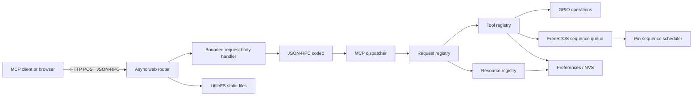
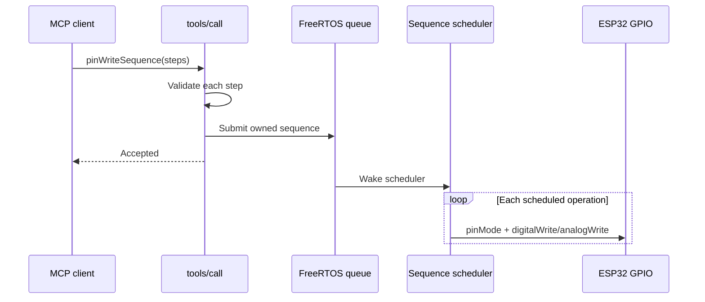

# ESP32 MCP Server

An open-source MCP server for an ESP32 running the Arduino framework. It exposes
GPIO read/write operations, a small persistent component memory, serial output,
and a scheduled GPIO sequence API over HTTP so an MCP client or a local web UI
can interact with physical hardware.

> **LAN-only warning:** This project intentionally does **not** include
> authentication or authorization. Anyone who can reach the device can call its
> tools, including tools that change GPIO state, write to NVS, and print to the
> serial port. Run it only on a trusted, isolated LAN or behind an access
> controlled network boundary. Do not port-forward it to the internet.

## What It Does

- Runs an asynchronous HTTP server on the ESP32.
- Serves a static frontend from LittleFS at `/` and `/connections`.
- Exposes device information at `/info`.
- Accepts MCP JSON-RPC messages at `POST /mcp`.
- Reads digital and analog GPIO values.
- Writes digital and PWM-style analog GPIO values.
- Schedules ordered GPIO write sequences with delays.
- Remembers and forgets component descriptions in ESP32 Preferences/NVS.
- Exposes those saved descriptions as an `esp32://components` MCP resource.
- Optionally refreshes the frontend from a configured HTTPS URL.
- Applies an HTTP rate limit and Origin checks intended to reduce accidental
	cross-origin access and DNS-rebinding risk.

The firmware is designed for experimentation, home automation, robotics, and
hardware prototyping. It is not a general-purpose internet-facing gateway.

## Current Status

This repository is an early-stage project. The firmware currently builds for the
NodeMCU-32S target, but there are no automated protocol, integration, fuzz, or
hardware tests yet. Review the security and protocol limitations below before
deploying it outside a development network.

## MCP 2026-07-28 Compatibility

### Implemented server features

The code currently registers these MCP request methods:

- `server/discover`
- `tools/list`
- `tools/call`
- `resources/list`
- `resources/read`

The implementation also uses the 2026-07-28-style `resultType` field in result
responses and advertises the following capabilities:

- `tools`
- `resources`
- No prompts
- No resource subscriptions
- No list-change notifications

The HTTP endpoint is a JSON response endpoint for POST requests. It does not
implement a long-lived SSE subscription stream.

### Not implemented yet

The following 2026-07-28 areas still need implementation or conformance tests:

- Complete Streamable HTTP validation, including required request headers,
	header/body matching, `Accept` negotiation, and all required status codes.
- Complete per-request `_meta` validation and protocol-version negotiation.
- MCP HTTP authorization and bearer-token validation. This is intentionally
	deferred, but the LAN-only restriction remains mandatory.
- Pagination cursors for `tools/list` and `resources/list`.
- `resources/templates/list` and resource templates.
- `subscriptions/listen`, resource subscriptions, and list-change notifications.
- Prompt discovery and prompt retrieval.
- Progress, cancellation, logging, and other optional utilities.
- Multi-round-trip input-required results.
- Schema validation against the advertised JSON Schemas.
- Conformance tests against the official 2026-07-28 schemas and transport rules.

The project should be treated as **partially compatible**, not as a certified
or complete MCP 2026-07-28 implementation.

## Available Tools

### `pinRead`

Reads a GPIO in one of these modes:

- `DIGITAL_PULLUP`
- `DIGITAL_PULLDOWN`
- `DIGITAL`
- `ANALOG`

Example arguments:

```json
{
	"pin": 2,
	"mode": "DIGITAL"
}
```

### `pinWrite`

Writes one GPIO. Provide exactly one of `analogValue` or `digitalValue`.
`analogValue` is documented as ranging from `0` to `4095`; `digitalValue` is
`HIGH` or `LOW`. An optional `delayAfter` value is accepted by the shared pin
validation code.

Example arguments:

```json
{
	"pin": 4,
	"digitalValue": "HIGH"
}
```

### `pinWriteSequence`

Queues an ordered array of pin operations. Each step uses the same pin/value
arguments as `pinWrite`, with an optional `delayAfter` in milliseconds.

Example arguments:

```json
{
	"steps": [
		{ "pin": 4, "digitalValue": "HIGH", "delayAfter": 500 },
		{ "pin": 4, "digitalValue": "LOW" }
	]
}
```

The scheduler is asynchronous: a successful tool result means the sequence was
accepted for scheduling, not that every operation has already completed.

### `rememberComponent`

Stores a component name and notes for a GPIO pin in ESP32 Preferences/NVS.

Arguments:

```json
{
	"pin": 4,
	"name": "status LED",
	"notes": "Active-high indicator LED"
}
```

### `forgetComponent`

Removes the saved component description for a GPIO pin.

### `printToSerial`

Writes a caller-provided message to the ESP32 serial stream. Because this is an
arbitrary output channel, it should be treated as a privileged operation on a
shared or production device.

## Hardware Requirements

- ESP32 development board compatible with the `nodemcu-32s` PlatformIO board
	definition.
- USB cable and a working serial connection for flashing and monitoring.
- 2.4 GHz Wi-Fi network supported by the board.
- Components wired to GPIOs according to the board's electrical limits.
- A host on the same trusted LAN running an MCP client or web browser.

The firmware currently assumes ESP32 GPIO numbering and excludes several pins
reserved by the board, flash interface, serial interface, or other hardware.
Do not connect loads directly to GPIOs when the load requires more current or
voltage than the ESP32 supports. Use suitable drivers, resistors, level
shifters, and external power supplies.

## Setup

### 1. Install tooling

Install VS Code with PlatformIO, or install PlatformIO Core. The project uses:

- Espressif32 platform
- Arduino framework
- `ESP32Async/ESPAsyncWebServer`
- `bblanchon/ArduinoJson`

### 2. Configure Wi-Fi

Create a local `.env` file from `.env.template`:

```dotenv
WIFI_SSID="your-network-name"
WIFI_PWD="your-network-password"
```

The `scripts/load_env.py` PlatformIO pre-script converts these values into build
flags. Keep `.env` private and never publish real credentials. The local editor
configuration may also contain generated build values.

### 3. Connect and build

From the project directory:

```sh
pio run --environment nodemcu-32s
```

### 4. Flash the board

Connect the board over USB, select the appropriate upload port if PlatformIO
does not detect it automatically, and run:

```sh
pio run --environment nodemcu-32s --target upload
```

Monitor startup output with:

```sh
pio device monitor --environment nodemcu-32s
```

The device prints its assigned IP address after connecting to Wi-Fi. The MCP
endpoint is then:

```text
http://<device-ip>/mcp
```

The default HTTP port is `80`. It can be changed with the `WEB_SERVER_PORT`
build definition.

## Architecture



### Request flow

1. `ESPAsyncWebServer` receives `POST /mcp` and collects the request body.
2. ArduinoJson parses the JSON document.
3. The JSON-RPC codec extracts the method, ID, and parameters.
4. `mcpDispatch.cpp` looks up the method in a request or notification registry.
5. Request handlers route to a tool or resource registry.
6. The handler writes its result into the response document.
7. The HTTP layer serializes the response as JSON.

### GPIO sequence flow



## Extending the Server

The registry-based design is intended to make tools and resources easy to add
without changing the central dispatcher.

### Add a custom tool

1. Create a `.cpp` file under `src/mcp/handlers/tools/`.
2. Define a `SchemaProperty` array and `ToolInputSchema`.
3. Implement a handler with this signature:

```cpp
void handleMyTool(JsonObjectConst arguments, JsonVariant result) {
		// Validate arguments and perform the operation.
		writeToolSuccess(result, "success");
}
```

4. Register it with `MCP_TOOL_DEF`:

```cpp
static const SchemaProperty myToolProps[] = {
		{"message", "string", "message to process", true},
};

static const ToolInputSchema myToolSchema = {myToolProps, 1};

MCP_TOOL_DEF(
		"myTool",
		"A short description of what the tool does.",
		myToolSchema,
		handleMyTool);
```

Use `requireArg<T>` for type checks and return input or business-logic failures
with `writeToolError`. Validate bounds and permissions inside the handler; the
tool schema is descriptive and should not be treated as the only security
boundary.

For arrays or other custom schemas, provide a schema writer function like
`writePinWriteSequenceInputSchema` and set the third member of
`ToolInputSchema` to that function.

### Add a custom resource

1. Create a handler under `src/mcp/handlers/resources/`.
2. Populate the `contents` array in the result.
3. Register the resource with `MCP_RESOURCE_DEF`:

```cpp
void handleReadMyResource(JsonVariant result) {
		JsonObject content = result["contents"].add<JsonObject>();
		content["uri"] = "esp32://my-resource";
		content["mimeType"] = "text/plain";
		content["text"] = "resource contents";
}

MCP_RESOURCE_DEF(
		"esp32://my-resource",
		"My Resource",
		"A short description.",
		"text/plain",
		handleReadMyResource);
```

Resource handlers should validate identifiers, avoid exposing secrets, and
bound the amount of data copied into a response.

### Add a request method or notification

For a new request-level MCP method, implement an
`McpRequestHandlerFn` and register it with `MCP_REQUEST_HANDLER`. Notification
handlers use `MCP_NOTIFICATION_HANDLER`. Keep protocol parsing and transport
logic in the codec/web layers; application behavior belongs in the handler.

## Repository Layout

| Directory or file | Purpose |
| --- | --- |
| `src/main.cpp` | Firmware startup, Wi-Fi connection, filesystem and task startup. |
| `src/env.h` | Compile-time checks for required local Wi-Fi definitions. |
| `src/config/` | JSON-RPC and server metadata/capability configuration. |
| `src/mcp/` | MCP dispatch, JSON-RPC types/codecs, registries, tools, and resources. |
| `src/mcp/handlers/requests/` | Implementations of MCP request methods. |
| `src/mcp/handlers/tools/` | Built-in GPIO, serial, and component-memory tools. |
| `src/mcp/handlers/resources/` | Resource implementations, including persistent component memory. |
| `src/mcp/registries/` | Extensible registries for tools, resources, requests, and notifications. |
| `src/pin_write/` | Shared GPIO argument validation and pin operation types. |
| `src/tasks/` | FreeRTOS tasks for GPIO scheduling and frontend refresh. |
| `src/web/` | HTTP routes, middleware, static file serving, and MCP body handling. |
| `scripts/` | PlatformIO helper scripts, including local environment loading. |
| `platformio.ini` | Board, framework, dependencies, build, upload, and monitor settings. |
| `.env.template` | Example local configuration keys. |

## Configuration and Operational Notes

Several values can be supplied as build definitions so deployments can adapt
without changing source code, including Wi-Fi settings, the web port, rate-limit
settings, request body limits, sequence limits, and frontend refresh settings.
The exact defaults are defined beside the code that uses them.

The optional frontend refresh task downloads `/app.html` from the configured
frontend source at a fixed interval. For production-like use, review that URL,
use a trusted HTTPS endpoint, and consider disabling the task or serving a
locally bundled frontend.

The device exposes operational serial messages for startup and failures. The
`printToSerial` tool additionally writes user-provided content to that stream.

## Contributing

Useful contributions include:

- MCP 2026-07-28 conformance and transport tests.
- Hardware-in-the-loop GPIO tests.
- Bounded/fixed-allocation alternatives for embedded memory use.
- Better board-specific pin capability configuration.
- Secure frontend distribution and update verification.
- Documentation and examples for MCP clients.

Please keep changes small, document externally visible behavior, and test with
`pio run --environment nodemcu-32s` before opening a pull request.

## License

See [`LICENSE.md`](LICENSE.md).
